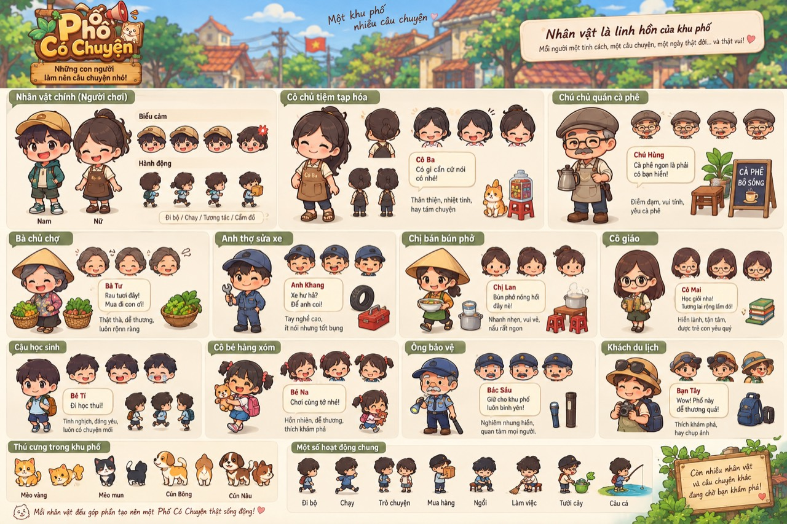
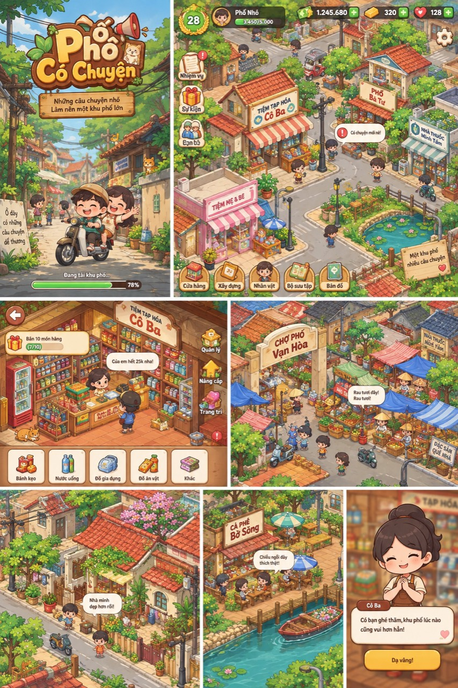
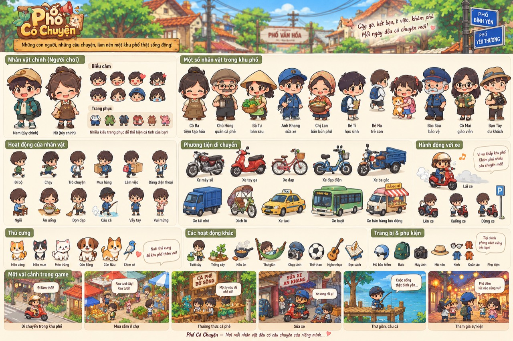
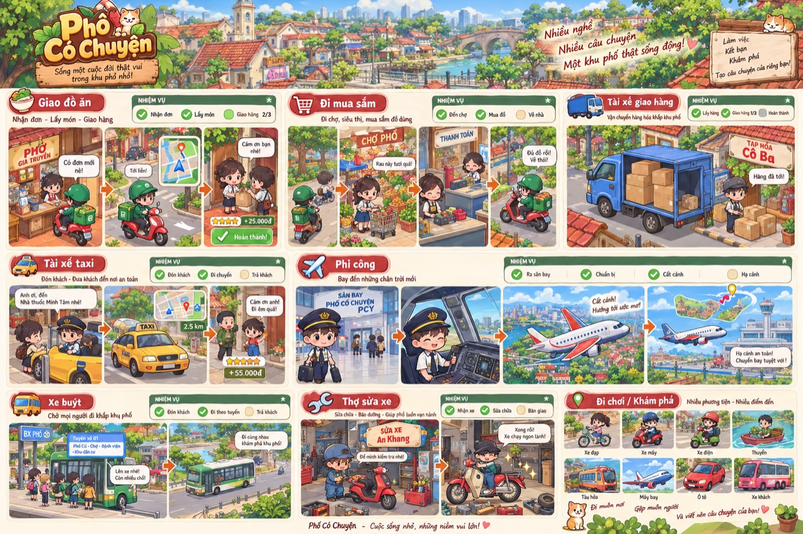
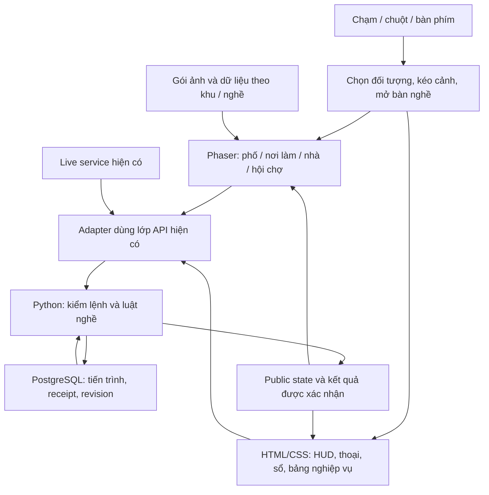

# Phố Có Chuyện — phương án chuyển sang cảnh phố isometric

| Thông tin | Nội dung |
| --- | --- |
| Ngày | 05/10/2026 |
| Trạng thái | Đề xuất để tham khảo; chưa triển khai |
| Phạm vi | Hướng mỹ thuật, giao diện, công nghệ, hiệu năng, lộ trình và bàn giao |
| Ràng buộc đã xác nhận | Dùng bộ ảnh phố, nhân vật, phương tiện và nhiệm vụ người dùng cung cấp làm tham chiếu chính; có thể học thêm hội chợ; ưu tiên tĩnh để nhẹ |
| Nguồn khảo sát | Mã tại `wt-feedback-0410`, tài liệu hiện có và ảnh người dùng cung cấp |

## 1. Phương án đề xuất trong một trang

Chuyển Phố Có Chuyện thành một khu phố Việt Nam nhìn chéo từ trên xuống, hình ảnh hoạt hình có nhiều chi tiết sinh hoạt, nhân vật chibi và HUD minh họa. Khu phố kết nối các nghề; khi vào công trình, người chơi được nhìn rõ nội thất và bàn thao tác của nghề đó.

Sau bộ ảnh bổ sung, đề xuất cụ thể hơn là **phố tĩnh có tương tác, người chơi tùy biến, phương tiện đi theo tuyến và công việc theo từng bước**. Cảnh ngoài phố, nội thất và bàn thao tác cận là ba mức hiển thị; các cảnh bay/đi xa mở riêng khi cần. Không cần một thế giới 3D liên tục hoặc mọi nhân vật đều tự đi lại để có diện mạo như mẫu.

Đề xuất kỹ thuật là Phaser + TypeScript cho phần cảnh, HTML/CSS cho HUD và bảng nghiệp vụ, giữ Python/PostgreSQL cùng giao thức game hiện có. Chuyển từng nhóm cảnh sau khi kiểm chứng một góc phố trên điện thoại. Đây là phương án đang cân nhắc, chưa phải quyết định cài engine hay thay mã nguồn.

Nguyên tắc hiệu năng: **đồ vật tĩnh mặc định; thay hình khi trạng thái đổi; chuyển động chỉ chạy trong thời gian có tác dụng**. Nhiều chi tiết có thể nằm trong hình tĩnh mà không cần nhiều đối tượng được cập nhật liên tục.

Đọc thêm [danh mục màn hình, 41 nghề và asset](DANH_MUC_MAN_HINH_ASSET_ISOMETRIC_2026-10-05.md).

## 2. Hướng mỹ thuật theo bộ ảnh tham chiếu

### Tham chiếu chính

Ảnh nhân vật là bảng thiết kế dáng, biểu cảm và hành động. Ảnh khu phố là montage ý tưởng gồm màn tải, toàn cảnh phố, cửa tiệm, chợ, nhà, quán ven nước và thoại. Chúng xác định diện mạo mong muốn, không chứng minh sẵn cơ chế chơi, bộ sprite tách lớp hoặc hiệu năng.

### Bổ sung: nhân vật, phương tiện và chuỗi nhiệm vụ

Ảnh nhân vật thứ hai của lần gửi bổ sung trùng nguyên file với bảng nhân vật đã lưu, kiểm bằng SHA256; dùng lại file để tránh lưu trùng. Bộ tham chiếu chính hiện có bốn ảnh khác nhau.

| Phần mới nhìn rõ trong ảnh | Điều chỉnh hướng thiết kế |
| --- | --- |
| Quần áo, tóc và phụ kiện | Định nghĩa lớp nhân vật và điểm gắn; giữ ID ngoại hình trong bản lưu; không vẽ sẵn mọi tổ hợp |
| Đi bộ, ngồi, ăn, làm việc, điện thoại | Là thư viện tư thế; mỗi nghề chỉ tải tư thế thật sự dùng; phần lớn tư thế đứng/ngồi là hình tĩnh |
| Xe máy, xe đạp, ô tô, thuyền, máy bay | Chia gói theo loại và cảnh; xe đỗ dùng sprite tĩnh; chỉ xe đang dùng có chuyển động |
| Lên xe, xuống xe, đỗ xe | Các trạng thái chuyển ngắn; sprite người và xe có điểm ghép khớp nhau |
| Nhiệm vụ có từng bước | HUD nêu bước hiện tại và điểm đến; bước hoàn tất lấy từ kết quả server |
| Phố ngày và hội đêm | Biến thể màu/đèn theo trạng thái hoặc gói riêng; không bắt buộc đèn/nước/lá chạy liên tục |
| Cảnh bay và đi xa | Cảnh riêng, có thể dùng nền tĩnh và chuyển động ngắn của máy bay; mức điều khiển phụ thuộc gameplay nghề |

Ảnh kết hợp bản đồ nhìn chéo, chân dung chính diện, cabin và tranh minh họa. Không cần ép mọi màn thành cùng một bản đồ isometric: thế giới cần thống nhất phép chiếu, còn chân dung và bàn thao tác chọn góc dễ đọc nhất.

### Những đặc điểm sẽ giữ trong thiết kế

| Thành phần | Hướng đề xuất |
| --- | --- |
| Khu phố | Nhà thấp tầng, mái ngói đỏ, tường vàng kem, hẻm và vỉa hè, dây điện, chậu cây, xe máy |
| Nét vẽ | Viền nâu mềm, khối tròn vừa phải, có chất liệu và bóng nhẹ; tránh khối hình quá đơn giản |
| Màu | Đỏ ngói, vàng tường cũ, nâu gỗ, xanh lá cây, xanh nước; điểm màu nhận diện từng cửa tiệm |
| Nhân vật | Đầu lớn, thân nhỏ, mắt và biểu cảm rõ; phân biệt bằng tóc, trang phục, tư thế và phụ kiện |
| Nội thất | Nhìn chéo, mở mái/tường cần thiết; quầy, nền gạch và kệ có chiều sâu |
| HUD | Bảng gỗ, giấy kem, sổ, icon minh họa; chữ và số hiển thị bằng code để rõ và dịch được |
| Thoại | Chân dung lớn dạng hình tĩnh, tên người nói và lời thoại dễ đọc; biểu cảm đổi theo câu chuyện |
| Màn tải | Một tranh minh họa phối cảnh tự do; không cần dùng cùng phép chiếu với bản đồ |

Góc nhìn bản đồ và nội thất cần cùng quy chuẩn. Đề xuất thử trục nền theo tỷ lệ 2:1 thường dùng cho bản đồ nhìn chéo, rồi chốt bằng mẫu nhà–người–đồ vật. Không suy ra góc chính xác chỉ từ ảnh montage, cũng không cần 3D để đạt diện mạo này.

Các tên như Cô Ba, Chú Hùng trong ảnh là tham chiếu ý tưởng. Khi thiết kế chính thức phải đối chiếu nhân vật và cốt truyện hiện có, tránh vô tình đổi tên hoặc mất quan hệ người chơi đã xây dựng. Giữ khả năng thể hiện trang phục, giới tính và tùy biến ngoại hình đang có.

### Vai trò của hội chợ hiện tại

Hội chợ bổ sung cách dùng màu gỗ, giấy kem, đỏ gạch, vàng đèn, mái bạt sọc và nhân vật. Bộ ảnh người dùng là chuẩn hình ảnh chính vì mô tả rõ phố ban ngày, nội thất, người và phương tiện mong muốn.

Trong mã hội chợ, `fair-place.js` đã tách nền và đồ vật; `fair-walk.js` dùng nền cache, bitmap cho một số đồ vật tĩnh, sắp thứ tự theo vị trí chân và dừng vòng vẽ khi tab ẩn. Cảnh vẫn có nhịp vẽ nghỉ khoảng 80 ms nếu không bật giảm chuyển động, vì còn đung đưa nhân vật. Hướng mới ưu tiên bỏ chuyển động trang trí liên tục này ở chế độ nhẹ. Đây là quan sát code, không phải số đo FPS hiện tại.

## 3. Thế giới và giao diện sau chuyển đổi

Luồng chính: **mở khu phố → chọn công trình/nhân vật → vào nơi làm → thao tác nghề → thấy kết quả trong cảnh → trở lại phố**.

Đề xuất chia thế giới thành các khu có liên hệ: phố cửa tiệm, chợ và hàng ăn, khu nhà ở, trường học và văn phòng, bờ sông–chùa–nông trại, hội chợ và điểm chuyển tới sân bay. Không nhét mọi nghề vào cùng màn hình đầu tiên. Sân bay là cảnh riêng; người chơi đi tới bằng một điểm giao thông trên phố.

| Màn hình | Bố trí đề xuất |
| --- | --- |
| Toàn cảnh phố | Cảnh chiếm phần lớn màn hình; kéo/zoom; chọn nhà, người hoặc bảng chỉ dẫn |
| HUD trên | Hồ sơ nhỏ, giờ trong game, tiền liên quan; không lặp mọi loại ví/quỹ |
| Mục tiêu | Một mục tiêu đang theo dõi, thu gọn được; mục tiêu khác nằm trong sổ |
| Thanh dưới | Phố, công việc, đời sống, cộng đồng và mở thêm; nhãn rõ bên dưới icon |
| Bên trong nghề | Cảnh nội thất + khách chờ + bước cần làm; mở vùng thao tác lớn khi công việc cần độ chính xác |
| Quản lý | Sổ tiệm, kho, chứng từ, nhân viên, giá; bảng nổi đồng bộ với phong cách cảnh |
| Thoại | Chân dung tĩnh lớn + lời nói + lựa chọn; chỉ hiện khi có tương tác |
| Cài đặt/tài khoản | HTML/CSS đồng bộ chất liệu; giữ nhập liệu, bàn phím và các lựa chọn hiện có |

Các hoạt động pha chế, gói hàng, kiểm phiếu, sửa đồ và chăm sóc khách vẫn là công việc trực tiếp. Từ cảnh có thể mở bàn thao tác cận hơn, tránh buộc người chơi bấm những món đồ quá nhỏ. Bảng số liệu kế toán cần ưu tiên khả năng đọc; không biến cả bảng thành một texture nhỏ trên bàn.

Thiết kế điện thoại dọc là ưu tiên đầu tiên. Tránh để HUD che cửa tiệm hoặc nhân vật đang chọn; zoom chỉ tác động cảnh. Giữ thao tác tương đương bằng nút/danh sách cho người dùng bàn phím và người không muốn điều khiển nhân vật đi bộ.

### Chuyển chuỗi nhiệm vụ trong ảnh thành trải nghiệm

Ví dụ giao đồ ăn: nhận đơn ở quán → mở tuyến/đi tới nơi lấy món → lấy món theo trạng thái nhiệm vụ → di chuyển → giao khách → xem kết quả. Cảnh thay đổi theo bước; không cần tải mọi nơi đến cùng lúc.

Một bảng bước dùng chung chứa tên nhiệm vụ, bước hiện tại, điểm đến và hành động tiếp theo. Mỗi nghề ánh xạ luật riêng vào bảng này; không đổi thứ tự nghiệp vụ chỉ để giống ảnh. Đi bộ/lái xe có thể tự theo tuyến hoặc điều khiển trực tiếp theo thiết lập và nghề. Nghề giao hàng đang có thao tác điều khiển cần giữ trải nghiệm đó; chuyến đi đời sống có thể chọn điểm đến và di chuyển ngắn.

Thanh tiến độ, dấu hoàn tất và phần thưởng phải theo state server. Dùng xu và cách ghi tài nguyên hiện có; số thưởng bằng đồng trong ảnh là minh họa, chưa là đề xuất đổi kinh tế game.

### Phạm vi chuyển đổi và ý tưởng mở rộng

| Nội dung ảnh | Căn cứ trong game khảo sát | Xử lý trong phương án |
| --- | --- | --- |
| Giao đồ ăn | Có nghề `delivery` | Chuyển hình và cách trình bày các bước, giữ luật và điều khiển cần thiết |
| Phi công | Có `pilot` và `flight_attendant` | Chuyển theo nhóm hàng không; sân bay/cabin/chuyến bay là cảnh riêng |
| Xe đạp, xe máy, ô tô, thuyền, máy bay sở hữu | `game/garage.py` có các nhóm phương tiện và ID được lưu | Giữ sở hữu, màu, lựa chọn xe, phí và luật chuyến đi; kiểm cách hiển thị/di chuyển từng loại |
| Đi mua sắm | Có kho, mua hàng và các chức năng đời sống; chưa xác nhận chuỗi giỏ hàng đúng như ảnh | Đổi các màn mua hiện có; trải nghiệm mua sắm nhiều điểm là phần mở rộng nếu cần |
| Taxi và xe buýt | Không có plugin nghề tương ứng trong danh mục 41 nghề khảo sát | Ghi vào ý tưởng tương lai; chưa thêm vào đợt chuyển giao diện |
| Tài xế xe tải | Không có plugin nghề riêng tương ứng trong danh mục khảo sát | Xe trang trí/gói hình có thể tham khảo; nghề vận tải là phạm vi bổ sung |
| Tiệm sửa xe Anh Khang | `repair` xử lý thiết bị điện/điện tử và cả xe đạp; chưa có cơ chế sửa xe máy/ô tô tương ứng trong danh sách thiết bị | Dựng quầy sửa đúng nghề hiện có, gồm xe đạp; sửa xe máy/ô tô là mở rộng cần thiết kế riêng |
| Xe ba gác, xích lô, xe bán hàng, tàu hỏa | Là ý tưởng phương tiện trong bộ ảnh, chưa xác nhận cơ chế chơi riêng | Ưu tiên sprite tĩnh trang trí nếu dùng; chỉ có chuyển động khi một tính năng cần |

Số nghề trong phạm vi khảo sát vẫn là 41. Đổi phong cách không tự đưa các nghề gợi ý trong ảnh thành tính năng đã có hoặc đã được yêu cầu triển khai.

## 4. Chính sách tĩnh và chuyển động

| Mức | Áp dụng | Cách dựng |
| --- | --- | --- |
| Tĩnh | Đường, nền gạch, tường, mái, hàng trang trí, cây, biển hiệu, bàn ghế, bóng đổ | Sprite hoặc mảng hình cache; không có update riêng mỗi frame |
| Đổi theo trạng thái | Tiệm mở/đóng, kệ còn/hết hàng, nâng cấp, đèn bật/tắt, ly đang pha, biểu cảm | Đổi sprite/frame hoặc lớp hiển thị sau sự kiện; giữa các lần đổi vẫn tĩnh |
| Chuyển động cần thiết | Người đang đi, vòng đang ném, thao tác nghề theo thời gian, kéo đồ vật | Chạy lúc hoạt động; kết thúc thì trở về tư thế tĩnh |
| Phản hồi ngắn | Nút được bấm, món được đặt, hoàn tất việc, mở cửa | Một chuyển động ngắn hoặc thay hình; có thể tắt bằng giảm chuyển động |
| Trang trí tùy chọn | Lá rung, mặt nước, khói, đèn đung đưa | Mặc định tĩnh trên cấu hình nhẹ; chỉ thêm khi đo còn dư tài nguyên |

Quy tắc cụ thể:

- Người đứng chờ có một dáng nghỉ, không bắt buộc thở/nhún liên tục. Chân dung hội thoại đổi biểu cảm bằng ảnh tĩnh.
- Người ngồi, ăn hoặc cầm điện thoại có thể là tư thế tĩnh đổi theo trạng thái. Không cần animation cho mọi tư thế trên bảng nhân vật.
- Xe đỗ, xe nền và thuyền tại bến tĩnh. Chỉ phương tiện đang do người chơi sử dụng hoặc có nhiệm vụ hiện thời mới chạy cập nhật vị trí.
- Nhân vật/xe di chuyển theo tọa độ và sprite; không cần mô phỏng vật lý bánh xe, treo xe hoặc va chạm phức tạp cho việc dạo phố.
- Cây, hoa, mái bạt, dây điện và đèn lồng không cần animation. Nước ao dùng texture tĩnh; thuyền đứng bến không bắt buộc lắc.
- Gói bánh, chai lọ trên kệ gộp thành nhóm trang trí. Chỉ món được thao tác riêng mới cần đối tượng riêng.
- Tường/mái có thể tĩnh nhưng vẫn phải tách nếu cần ẩn để nhìn nội thất. Đồ vật phía trước cần tách để che nhân vật đúng.
- Không gộp nguyên khu phố thành một ảnh duy nhất nếu phải đi trước–sau nhà, nâng cấp hoặc đổi vị trí đồ vật. Gộp theo lớp và cụm có chức năng.
- Nhân vật nền có thể đứng trò chuyện theo nhóm tĩnh. Không cần mọi người đều tự tìm đường và đi vòng quanh.
- Khi mở bảng nghiệp vụ che cảnh, dừng animation cảnh và timer trang trí. Nghiệp vụ theo giờ máy chủ vẫn tuân theo luật đang có.

**Tĩnh không đồng nghĩa tự động nhẹ:** một texture khổng lồ, nhiều lớp trong suốt hoặc vòng render vẫn chạy đầy tốc độ vẫn có thể tốn bộ nhớ và GPU. Cần kiểm cả kích thước texture, vòng cập nhật và vòng vẽ.

## 5. Kiến trúc hiện tại và phần cần giữ

Khảo sát source cho thấy frontend JavaScript ES modules, CSS, Canvas 2D và icon SVG. `BobaWorld` mở rộng `World`; có module dựng cảnh theo nhóm nghề và module bàn thao tác riêng. Python xử lý nội dung/luật, PostgreSQL lưu tiến trình; có lớp live phục vụ các tương tác cộng đồng.

Đếm tĩnh định nghĩa và các plugin đang có trên đĩa cho kết quả **41 nghề**. Đây là phạm vi source khảo sát, không phải xác nhận tất cả nghề đã kiểm thử hoặc đang mở trên production. Một số README/tài liệu nền còn ghi 20 nghề hoặc ít hơn.

| Thành phần | Định hướng |
| --- | --- |
| Tài khoản, đăng nhập, bản lưu | Giữ giao thức và ID hiện có |
| Luật nghề, quỹ/ví, phần thưởng, kho | Máy chủ tiếp tục quyết định |
| Hàng đợi lệnh, chống lặp, revision, CSRF | Giữ qua adapter; không viết một đường gửi lệnh song song |
| Live/cộng đồng | Dùng kết nối hiện có; chỉ đăng ký cảnh/phòng cần thiết |
| Renderer Canvas và bố cục shell | Chuyển dần theo khu/nhóm cảnh |
| HTML của bàn nghề | Tái sử dụng logic và cấu trúc có ích; chỉnh thiết kế theo mẫu mới |
| Font tiếng Việt, ngôn ngữ, giảm chuyển động | Giữ và đưa vào tiêu chí nghiệm thu |
| Ảnh album, ảnh chụp, photobooth | Kiểm riêng chức năng xuất ảnh và dữ liệu người tham gia |

Kho mã có nhiều bản phát hành và thay đổi đang tồn tại. Cần chọn bản nền đã đối chiếu trước khi bắt đầu chuyển đổi; tài liệu này không xác nhận checkout khảo sát khớp hoàn toàn website đang chạy.

## 6. Các lựa chọn công nghệ

| Phương án | Lợi ích | Chi phí/rủi ro | Đánh giá cho dự án |
| --- | --- | --- | --- |
| Phaser + TypeScript, HUD HTML/CSS | Hệ thống scene, sprite, camera, input, texture; ranh giới cảnh rõ | Thêm engine và bước build; phải quản lý vòng vẽ, texture, lifecycle | Phương án ưu tiên để thử mẫu |
| Giữ Canvas, bổ sung TypeScript và renderer isometric | Tái sử dụng cache/painter/input nhiều hơn; giữ tải engine thấp | Tự quản lý camera, asset, scene và nhiều phần kỹ thuật | Phương án dự phòng nếu mẫu Phaser nặng hơn hoặc chuyển đổi quá tốn |
| Godot/Unity | Có trình dựng cảnh và workflow engine rộng | Viết lại/tích hợp lại nhiều; phải đo bản export web | Chỉ khảo sát lại khi mục tiêu chính chuyển sang native hoặc 3D |

Chưa chốt major/minor của Phaser. Chọn và khóa phiên bản sau kiểm chứng camera, input, nền tảng mobile và quy trình phát hành; không tự dùng bản mới nhất chỉ vì số phiên bản lớn hơn.

Tiled là công cụ soạn bản đồ, không bắt buộc người chơi tải trình soạn thảo. Có thể xuất dữ liệu hình và object layer rồi chuyển thành định dạng nhẹ mà runtime sử dụng. Với mẫu nhỏ, JSON bản đồ là đủ nếu dễ kiểm tra vị trí và vùng đi. [Tài liệu các lớp của Tiled](https://doc.mapeditor.org/en/stable/manual/layers/)

## 7. Kiến trúc mục tiêu đề xuất

Đề xuất một Phaser Game cho toàn ứng dụng, chuyển các scene theo khu; không tạo một engine cho từng công trình. Tài liệu Phaser mô tả một Game quản lý các hệ thống và nhiều scene. [Phaser Game](https://docs.phaser.io/phaser/concepts/game)

Các ranh giới cần có: dữ liệu bản đồ; renderer; điều khiển camera; đường đi/hitbox; adapter state; HUD; bàn nghề; tải và giải phóng asset. Đường đi được tính khi có điểm đến, không chạy lại mỗi frame. Depth dùng vị trí chân kết hợp lớp riêng cho quầy/tường/mái.

Khi mất phản hồi, hiện trạng thái chờ và đồng bộ theo cơ chế hiện có. Animation không được tự xác nhận đã bán, thanh toán, nhận thưởng hoặc hoàn thành công việc. Khi tab trở lại, lấy trạng thái hợp lệ rồi dựng lại cảnh; không phát bù toàn bộ animation đã lỡ.

Phaser có sự kiện ẩn/hiện và pause/resume. Nếu dừng toàn Game thì input Phaser cũng dừng: nút/handler đánh thức phải nằm ở lớp host phù hợp. Không chỉ pause rồi chờ chính input đã bị pause để tiếp tục. [Vòng đời Phaser Game](https://docs.phaser.io/phaser/concepts/game)

## 8. Ngân sách hiệu năng để thử nghiệm

**Các số dưới đây là mục tiêu ban đầu, chưa đo và chưa cam kết đạt.** Đo trên một điện thoại Android cấu hình thấp/trung bình, một iPhone dùng Safari và một desktop; ghi model, browser, mạng, nhiệt độ vận hành và thời gian chơi.

| Hạng mục | Mục tiêu thử mẫu |
| --- | --- |
| Dữ liệu tải trước lần chơi đầu | Khoảng 3 MB trở xuống sau nén cho code và ảnh cần thiết; báo riêng API, font và âm thanh |
| Tải nội thất tiếp theo | Khoảng 1–1,5 MB ảnh cho một gói nghề; gói lớn phải có lý do và đo lại |
| Texture | Ưu tiên atlas tối đa 2048×2048 trên cấu hình nhẹ; chia theo khu/nhóm dùng chung |
| Texture còn trong bộ nhớ | Bắt đầu với ngân sách khoảng 64 MiB cho ảnh giải nén; tính riêng framebuffer và bộ nhớ khác |
| Nhân vật nền | Mẫu phố khoảng 6–10 người hiện diện, chỉ vài người chuyển động; không giới hạn cứng người chơi thật theo số này |
| Nhịp hoạt động | 30 fps cho đi bộ/thao tác trên cấu hình nhẹ; 60 fps là tùy chọn khi thử đạt |
| Khi rảnh | Không cập nhật đồ trang trí/tìm đường; thử giảm hoặc ngủ render khi không ảnh hưởng input/live |
| Khi cảnh bị che hoặc tab ẩn | Dừng chuyển động và vẽ không cần thiết; giữ nghiệp vụ mạng theo yêu cầu chức năng |
| Thử độ bền | Đi vào/ra 10 lần giữa các cảnh; kiểm heap/texture không tăng mãi, không nhân đôi listener |

Phân biệt số frame animation với tốc độ engine: hình đi bộ có thể đổi frame chậm hơn trong khi tọa độ di chuyển được nội suy. `fps.target` chỉ là mục tiêu thông tin, không tự khóa vòng lặp; cần kiểm cơ chế giới hạn đúng phiên bản. [Cấu hình FPS Phaser](https://docs.phaser.io/api-documentation/typedef/types-core)

Một ảnh RGBA 2048×2048 chiếm khoảng 16 MiB chưa tính mipmap và các buffer; 4096×4096 khoảng 64 MiB. File WebP vài trăm KB vẫn có thể lớn khi giải nén. Bởi vậy không tải toàn bộ asset 41 nghề lúc mở game.

Tối ưu đề xuất: tải theo cảnh; dùng lại atlas chung; nền tĩnh chia cụm; chỉ giữ cảnh hiện tại và một phần dùng chung; giới hạn độ phân giải render phù hợp màn hình; chữ giữ ở DOM; giải phóng cache không còn dùng. Culling giảm vật thể cần vẽ nhưng không tự giải phóng texture đã tải.

Ngân sách phải so với bản hiện tại trên cùng thiết bị và cùng nhiệm vụ. Báo cáo lag hiện có phân biệt tải giao diện, reducer/bản lưu, mạng và AI. Chuyển renderer không tự xử lý độ trễ các phần máy chủ đó.

## 9. Lộ trình chuyển đổi và điều kiện đi tiếp

| Đợt | Sản phẩm xem được | Điều kiện hoàn thành | Rủi ro chính |
| --- | --- | --- | --- |
| 0. Thiết kế và kiểm kê | Tài liệu này, danh mục, tham chiếu, bản nền thống nhất | Rõ phạm vi, trạng thái tĩnh/động và chức năng cần giữ | Bỏ sót màn/nghề hoặc dùng nhầm bản nền |
| 1. Mẫu mỹ thuật | Một nhà, một nội thất, nhân vật nhỏ/lớn, cụm HUD | Đúng chất ảnh mới; nhìn nhỏ vẫn rõ | Đẹp ở ảnh lớn nhưng mờ khi chơi |
| 2. Góc phố chơi được | 3–5 mặt tiền, một nghề hoàn chỉnh, camera, khách, một nâng cấp | Luật cũ chạy đúng, cảm ứng tốt, đạt ngân sách trên thiết bị mục tiêu | Cache/texture/input nặng hoặc tích hợp lệnh sai |
| 3. Chuyển theo nhóm | Nhóm ăn uống, cửa hàng, dịch vụ, văn phòng, nhà… | Mỗi nghề có vòng chơi và khác biệt thao tác riêng | Dùng lại quá nhiều làm nghề mất đặc trưng |
| 4. Đời sống/cộng đồng | Nhà, hội chợ, ghé tiệm, thoại, photo và các sổ | Đồng bộ phòng, lưu/xuất ảnh và quan hệ đúng | Mất chức năng live hoặc camera/snapshot |
| 5. Phát hành | Gói build, kiểm thử, hướng dẫn vận hành và phục hồi | So dữ liệu và telemetry trước/sau, có đường quay về giao diện tương thích | Lỗi phiên bản asset hoặc dữ liệu không tương thích |

Tiệm trà sữa là ứng viên cho nghề mẫu vì đã có quầy và thao tác cụ thể; có thể thay bằng tạp hóa nếu cần kiểm chứng nhiều trạng thái kệ/quầy hơn. Hội chợ và chân dung là nguồn mẫu bổ sung. Chưa chọn nghề mẫu cuối cùng, chưa tạo mockup hay asset.

Theo bộ ảnh bổ sung, đề xuất cho đợt mẫu là đoạn phố với một tiệm hoàn chỉnh, nhân vật giữ tùy biến ngoại hình, một chân dung thoại và một chiếc xe máy có trạng thái đỗ/đang đi. Như vậy kiểm được chất hình, che khuất, camera, tùy biến và tương tác cơ bản mà chưa phải dựng toàn bộ hệ vận tải. Sau khi mẫu đạt, thêm một chuỗi giao hàng hiện có để kiểm chuyển điểm đến và HUD nhiệm vụ; rồi mới mở rộng nhóm cảnh và nhiều loại xe.

Chuyển nhóm nào xong thì kiểm nhóm đó, dùng feature flag hoặc đường preview riêng. Trong giai đoạn cùng tồn tại, frontend cũ và mới dùng chung API qua cùng adapter; tránh hai vòng cập nhật luôn chạy. Bản chuyển giao diện cố gắng giữ schema/ID. Nếu có thay đổi dữ liệu thì lập kế hoạch riêng, không mặc định rollback mã cũ là an toàn.

## 10. Khối lượng và chi phí

Chi phí chủ yếu gồm mẫu mỹ thuật, dựng asset theo lớp, tích hợp từng nghề, điều khiển trên điện thoại và kiểm thử. Số màn nghiệp vụ thường lớn hơn số cảnh; 41 nghề không có nghĩa chỉ có 41 ảnh.

Ưu tiên tiết kiệm: tái dùng vật liệu và đồ trang trí; nhóm tĩnh trên kệ; tư thế đứng và biểu cảm tĩnh; cảnh chung cho văn phòng/nhà nhưng bàn thao tác riêng. Các nghề như giao hàng, phóng dao hoặc một thao tác theo thời gian vẫn cần chuyển động đúng chức năng.

Phaser/TypeScript thêm bước build, khóa dependency và tạo gói release frontend. Tài nguyên ảnh làm tăng dung lượng lưu/CDN; chưa có cơ sở yêu cầu tăng máy chủ chỉ vì đổi phong cách. Ước lượng thời gian/tiền phải dựa trên danh mục asset đã chốt và tốc độ làm mẫu đạt chuẩn; tài liệu này chưa đưa giá hay lịch cố định.

## 11. Gói bàn giao nếu quyết định triển khai

1. Quy chuẩn mỹ thuật: palette, nét, tỷ lệ, ánh sáng, phép chiếu, font, mẫu HUD và nhân vật.
2. Asset nguồn và xuất: file lớp/editable nếu có, sprite/atlas, vùng chân, kích thước, ID và nguồn/quyền sử dụng.
3. Bản đồ và metadata: điểm vào, vùng đi, hitbox, vật cản, lớp che khuất, điểm tương tác và vùng camera.
4. Mã frontend: cấu trúc scene, adapter API, lifecycle, tải/giải phóng asset, hướng dẫn build và kiểm dependency.
5. Ma trận nghiệm thu từng nghề/màn: thao tác, phản hồi, lưu dữ liệu, offline/reconnect, thiết bị và hiệu năng.
6. Gói release: manifest phiên bản, cache policy, feature flag, migration nếu có và phương án khôi phục tương thích.

## 12. Những quyết định còn để tham khảo

Đã rõ: bộ ảnh người dùng là hướng chính, có thể học hội chợ, ưu tiên tĩnh và hiện chỉ làm tài liệu. Có thể dùng thêm tư thế, phương tiện và cách trình bày nhiệm vụ trong ảnh để chuẩn hóa thiết kế.

Cần quyết định trước đợt mẫu: nghề đầu tiên; mức chi tiết khi nhìn trên điện thoại; cách giữ nhân vật/cốt truyện; thiết bị tối thiểu; ngân sách art; kết quả so Phaser với Canvas. Không cần trả lời ngay để đọc tài liệu này.

## 13. Căn cứ và giới hạn khảo sát

- `game/content.py`, `game/extra_content.py`, `game/careers/__init__.py` và module plugin: phạm vi 41 nghề trên đĩa, đếm bằng AST không khởi động server.
- `public/js/app.js`, `api.js`, `boba-world.js`, `scenes/index.js`: shell, giao thức và họ cảnh.
- `public/js/scenes/fair-place.js`, `public/js/v4/fair-walk.js`, `fair-booth.js`, `public/css/fair.css`: chất liệu và cache/lifecycle hội chợ.
- `game/garage.py`, `public/js/v4/garage.js`, `ride.js`, `look.js`: phương tiện, lựa chọn đang đi và tùy biến ngoại hình; khả năng di chuyển từng mẫu xe cần kiểm riêng khi triển khai.
- `game/careers/repair.py`: nghề sửa đồ có điện thoại, quạt, nồi cơm, xe đạp, tai nghe và laptop; không tự suy thành nghề sửa xe máy/ô tô theo ảnh tham chiếu.
- `game/webassets.py`: URL có phiên bản, import map và cache nội dung; pipeline build mới phải tích hợp các nguyên tắc này.
- `docs/ARCHITECTURE.md`, `DESIGN.md`: tài liệu nền; số nghề và một số mô tả lịch sử không đại diện toàn bộ source mới.
- `docs/LAG_1.7.15_2026-10-05.md`: các quan sát lag đã ghi; không dùng thay benchmark frontend mới.
- Ảnh trong `docs/isometric-reference/`: bản sao nguyên file người dùng gửi, phục vụ tham chiếu; chưa chuyển thành asset runtime.

Chỉ tạo tài liệu và lưu ảnh tham chiếu trong đợt này. Không cài engine, sửa gameplay, tạo hình mới, chạy benchmark production hoặc deploy.
