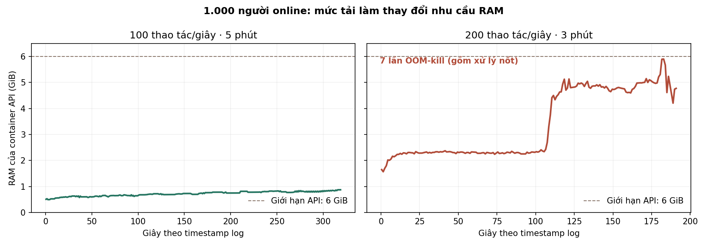

# Kiểm tra 1.000 người đồng thời — mục tiêu máy 9 core

Ngày 06/10/2026. Bản được đo: `f3ada34`. Đây là benchmark cục bộ bằng dữ liệu tổng hợp; không gửi tải vào production và không đổi mã game.

**Kết luận:** giữ 1.000 người online và di chuyển được. Bài 100 thao tác lưu/giây hoàn tất lượt 5 phút; mức 200 thao tác/giây chưa đạt độ ổn định, có lỗi thiếu RAM và worker bị dừng. Chưa thể cam kết “9 core bảo đảm 1.000 người chơi nặng” chỉ dựa vào số core.

## Số đo chính

P95: 95% mẫu hoàn tất trong thời gian này. Độ trễ là HTTP hoặc gửi/nhận socket trong mạng nội bộ; chưa gồm mạng Internet và thời gian vẽ trên điện thoại.

| Kịch bản | Thời gian cấu hình | Lệnh lưu thành công | P95 lệnh lưu | P95 chuyển động tới người khác | P95 chat |
|---|---:|---:|---:|---:|---:|
| 1.000 người đều di chuyển, 3 tin chat/giây | 60 giây | — | — | 97.4 ms | 13.7 ms |
| 1.000 online, 500 di chuyển, 100 lệnh/giây | 300 giây | 30,000 | 73.0 ms | 99.5 ms | 16.6 ms |
| 1.000 online/di chuyển, 200 lệnh/giây | 180 giây | 35,124/35,607 đã gửi | 901.3 ms | 101.8 ms | 109.8 ms |

- Lượt 100 lệnh/giây: lỗi `{}`, thông lượng hoàn tất trong cửa sổ đo 100.0 lệnh/giây. RAM API lấy mẫu cao nhất 0.87 GiB; CPU API trung bình 1.42 core, realtime 0.21 core.
- Lượt 200 lệnh/giây: 483 lỗi HTTP/kết nối (1.36% số đã gửi), gồm timeout, ngắt kết nối và 409. P99 lệnh 6408.2 ms. RAM API chạm giới hạn 6 GiB; trong cửa sổ tải đã thấy một worker bị dừng, sau giai đoạn xử lý nốt cgroup ghi tổng **7 lần OOM-kill**, đối chiếu được log worker. Các tiến trình được supervisor khởi động lại. Trung vị nhanh không bù được phần lỗi/đuôi chậm này.
- Giới hạn ban đầu 4 GiB RAM API và 1 core PostgreSQL thất bại nặng hơn ở 200 lệnh/giây: 725 HTTP 503, 3.900 timeout, một worker OOM-kill. Lượt 6 GiB API / 2 core PostgreSQL có thông lượng cao hơn nhưng vẫn không đạt. Hai lượt không phải A/B nhân quả: revision/dữ liệu đã tiến lên và thời gian đo khác nhau.
- Realtime chia 1.000 người thành 34 khu, mỗi khu tối đa 30. Health có 35 phòng vì tính thêm kênh chat chung. 1.000 người đều di chuyển tiêu thụ khoảng 62.0 Mbit/giây payload WebSocket; chưa cộng TCP/TLS và tải hình ảnh.

## Môi trường và giới hạn suy luận cho 9 core

- Máy chủ lab: Docker Linux trên i7-12700K, **VM có 8 vCPU**, RAM VM khoảng 16 GiB. Không phải máy production 9 core. Bộ phát tải Linux cũng dùng chung VM (giới hạn 2 CPU), có theo dõi trễ event loop; máy đích có thể cho kết quả khác.
- Cấu hình lượt cuối: 8 HTTP worker, quota API 6 CPU / RAM 6 GiB; realtime 1 CPU / 768 MiB; PostgreSQL 2 CPU / 1.5 GiB. Tổng quota dịch vụ 9 CPU, nhưng CPU thực của VM vẫn chỉ có 8; không trình bày đây là phép đo trực tiếp đủ 9 core.
- PostgreSQL 16, `max_connections=120`; mỗi HTTP worker `PG_POOL=3`, `PG_POOL_MAX=8`. Realtime giữ giới hạn 30 người/khu, nhịp gửi khoảng 300 ms, không bỏ kiểm tra vị trí/tốc độ. Chỉ nâng giới hạn số kết nối/handshake cùng IP cho các bot từ một máy.
- 1.000 tài khoản giả: 900 save khoảng 162,017 byte và 100 save khoảng 4,701,855 byte; mỗi save có 41 nghề. Nội dung giả lặp lại nên nén tốt, chưa đại diện tình huống I/O xấu nhất của dữ liệu thật.
- Lệnh ghi thật `POST /api/command`, hành động `feed_like`, có CSRF, revision, ghi PostgreSQL và response delta/gzip. Đo đường đọc–sửa–ghi save; **không đại diện mọi thao tác của 41 nghề**, đơn hàng tự động tồn đọng, AI hoặc mọi tính năng realtime khác.
- Tải theo lịch cố định, mỗi người một lệnh/10 giây hoặc /5 giây; không chạy vòng lặp gửi nhanh nhất có thể. Một người chỉ có một request đang chờ. Có ghi số bỏ lỡ khi chậm, lỗi và request hoàn tất sau cửa sổ đo; không coi bot đang chờ timeout là đủ thông lượng mục tiêu.
- Số phòng/connections được đối chiếu health trong lúc đo. Các lượt hợp lệ đều có đủ 1.000 kết nối; một lượt vừa restart chỉ lên 994 đã bị hủy và không dùng làm kết quả.
- Thử Windows qua cổng publish Docker có P95 chuyển động 1.703 ms và độ trễ bộ phát tải cao hơn nhiều. Lượt nội bộ Linux dùng đường mạng và phiên bản client khác; giữ số liệu riêng, không quy toàn bộ chênh lệch cho một nguyên nhân duy nhất.
- Lượt kiểm tra 5 phút là bằng chứng ngắn hạn, chưa phải soak nhiều giờ, failover, mất gói Internet hoặc FPS trên thiết bị thật. Chưa có RAM/model CPU của máy 9 core đích tại lúc lập báo cáo.

## Tải HTML và tài nguyên

Thử riêng 1.000 lượt tải mỗi loại HTML, catalogue core, bundle Phaser; tổng 3,000 request. HTTP status: `{"200": 3000}`. P95 HTML 0.9 ms, catalogue 1.7 ms, bundle Phaser 4.8 ms. Đây là truyền HTTP nội bộ, có gzip và cache phía server, không phải thời gian mở xong toàn bộ game hay 1.000 trình duyệt được render đồng thời.

## Hướng xử lý trước khi chốt 1.000 người chơi nặng

1. Giữ phân khu 30 người và tách realtime khỏi đường ghi save. Phần di chuyển đang có dư CPU trong bài này.
2. Profile heap/đợt kiểm tra dữ liệu và hàng đợi request trên save lớn. Mỗi lệnh vẫn đọc và ghi cả save; cần giảm dữ liệu xử lý và giới hạn số thao tác đang xử lý để RAM không tăng tới OOM. OOM đã xác nhận; chưa kết luận chính xác đối tượng nào giữ RAM nếu chưa profile heap.
3. Đối chiếu RAM, CPU thực, SSD và băng thông máy 9 core. Không tăng worker chỉ vì còn core. RAM API 6 GiB trong bài tải cao vẫn chưa đủ cho cách xử lý hiện tại; không coi tăng RAM đơn thuần là bản sửa hoàn chỉnh.
4. Sau tối ưu, chạy lại cùng fixture/tải, rồi soak dài và thử staging đúng máy. Mục tiêu đề xuất cho lượt nghiệm thu: đủ 1.000 kết nối, không OOM/5xx/timeout, đạt thông lượng đã đặt, P95 API <300 ms và P95 chuyển động <150 ms trong mạng nội bộ.

## Bằng chứng

- [Số liệu tổng hợp](results.json): thông lượng, lỗi, percentile, tài nguyên và cấu hình từng lượt, gồm các lượt không đạt.
- Script/fixture/log cục bộ: `output/capacity-1000-20261006/` (`load.py`, `seed.py`, `supervise.py`, Dockerfiles, resource JSONL). Token giả nằm riêng và không đưa vào tài liệu/Git.
- Các container, database và cổng tải thử được tách khỏi preview 18891 và production. Kết quả này không thay đổi cấu hình production.
